# 基于Vue的物联网可视化平台，同时集成了安全预警系统。

# 1.简介

## 1.1  系统背景

​	随着物联网的不断发展以及大数据时代的到来，现在网络上传输的数据量不断地增加，例如物联网节点嵌入式设备的传感数据、智能家居的智能控制节点，如使用传统方式对数据以及设备进行管理，在设备以及数据种类的不断增加下，现有的方式可能会影响用户的实际体验。同时，由于数据具有不同的表现形式，例如符号、文字、数字等类型的数据，在庞大数据量的情况下，如果不经过处理直接展示给用户，那么用户的体验是非常糟糕的，以此为背景，本团队设计了BDI-IoT物联网可视化平台

# 2.注册

## 2.1注册界面

 

- 注册时，用户需输入合法的注册信息项，包括“用户名”、“密码”、“确认密码”、“姓名”、“昵称”、“手机号”、“性别”等，并勾选“同意条款和协议并完成注册“选项，点击注册按钮即可注册成功成为本软件会员。

- 点击“已经有账号了，点击这里登入”文字，可跳转至登录页面。

 

**以下是注册信息项合法标准：**

- 用户名：由5-18个字符组成，只能包括数字、字母和下划线。
- 密码：由5-18个字符组成，只能包括数字、字母和下划线。
- 再次确认密码：和输入的“密码”完全一致
- 姓名：用户真实姓名
- 昵称：自定义昵称，不受字符限制。
- 手机号：用户真实手机号。
- 性别：用户真实性别

 

 

# 3.登录

## 3.1登录界面

- 登录界面需输入“用户名”和“密码”，验证一致后可进入系统。
- 点击注册按钮即可跳转至“注册页面”。

 

# 4.首页

## 4.1首页界面

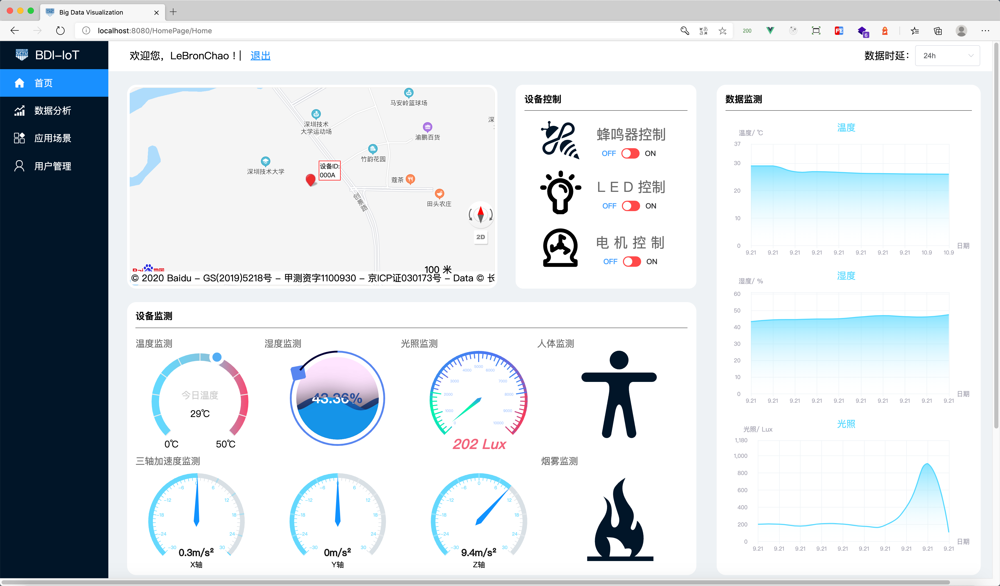

- 首页由“菜单栏”、“位置监测”、“设备控制”、“设备检测”、“数据监测”等模块组成

- 菜单栏包含首页、数据分析、应用场景、用户管理等按钮，点击对应按钮可跳转至对应页面。

 

## 4.2数据时延

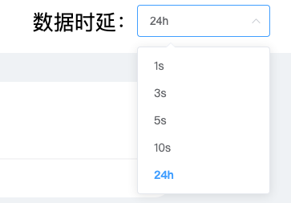

 

- 用户可通过选择器，选择数据更新频率。

## 4.2位置监测

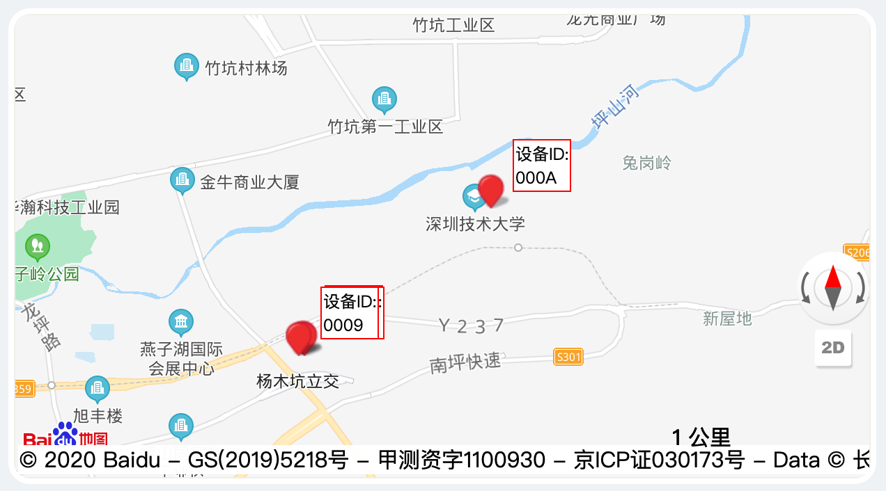

- “设备检测”模块显示的是真实地图、真实传感设备所在位置及显示对应的设备ID。用户可通过鼠标滚轮缩放地图。

## 4.3设备控制

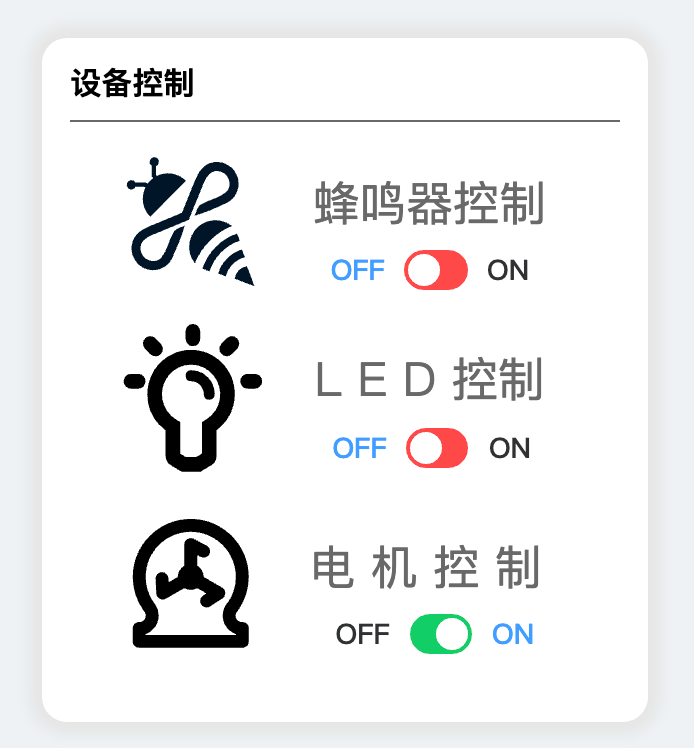

- “管理员”用户可通过“设备控制”模块的开关，控制实体设备的开启和关闭。

- 向左滑动为关闭按钮显示为红色，向右滑动为开启，按钮为绿色。

 

## 4.4设备检测

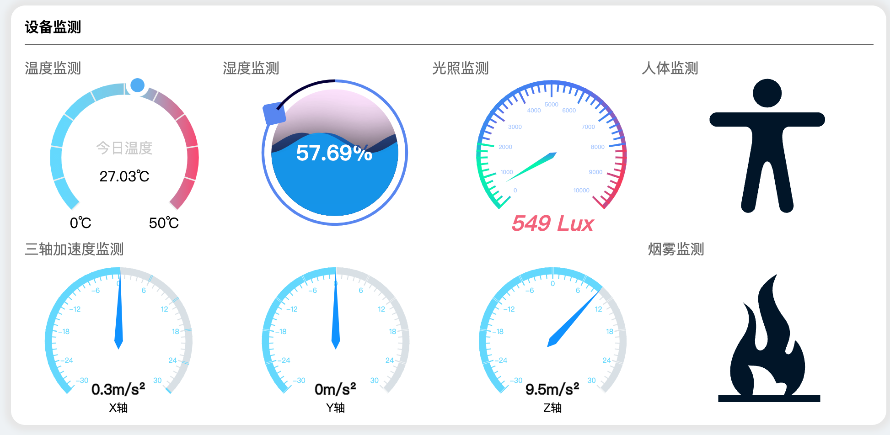

- “设备检测”模块的功能为实时显示传感数据。以上对应显示“温度”、“湿度”、“光照”、“三轴加速度(X/Y/Z)”的实时传感器数据。

- 此外附有人体监测和烟雾监测显示，红外传感器监测到人体时，人体标志红色闪烁显示为报警状态，深蓝色为平静状态。烟雾传感器监测到烟雾时，烟雾标志红色闪烁显示为报警状态，深蓝色为平静状态。

 

## 4.5数据监测

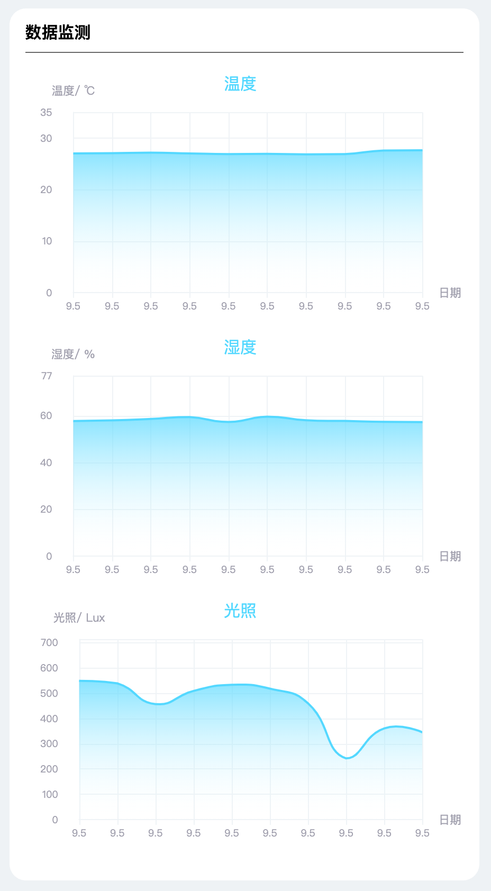

 

### 4.5.1温度数据监测

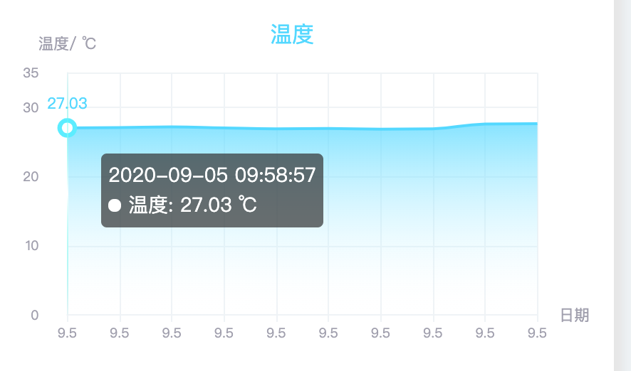

- 该图表显示的是最新的十条温度传感数据（单位为℃）  横坐标日期格式为：月-日  

- 鼠标位于具体坐标点上时显示具体日期和传感数据 时间格式为：年-月-日 时:分:秒

 

### 4.5.2湿度数据监测

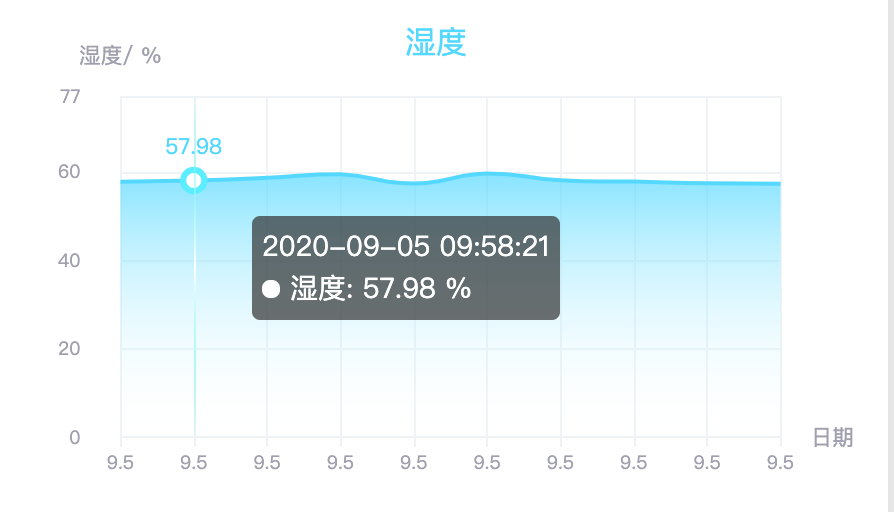

- 该图表显示的是最新的十条湿度传感数据（单位为%）  横坐标日期格式为：月-日  

- 鼠标位于具体坐标点上时显示具体日期和传感数据 时间格式为：年-月-日 时:分:秒

 

### 4.5.3光照数据监测

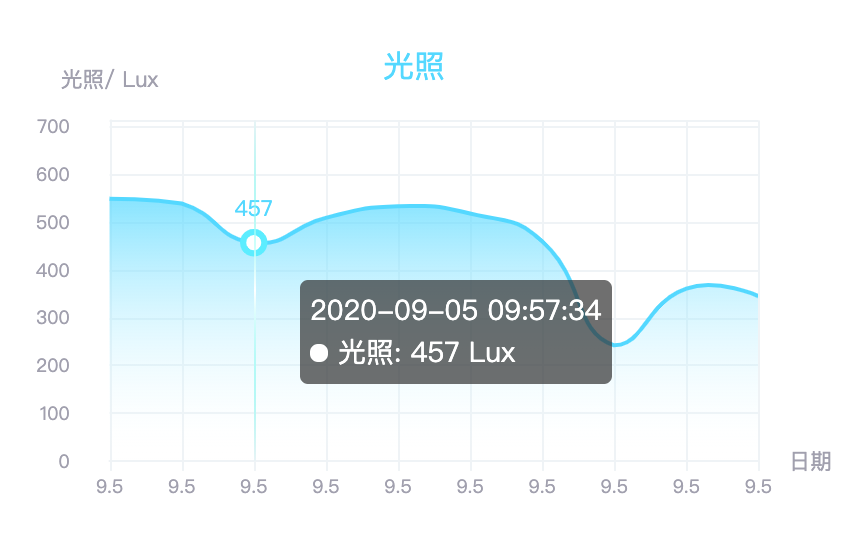

- 该图表显示的是最新的十条光照强度传感数据（单位为Lux）  横坐标日期格式为：月-日  

- 鼠标位于具体坐标点上时显示具体日期和传感数据 时间格式为：年-月-日 时:分:秒

 

 

# 5.数据分析

## 5.1传感数据可视化

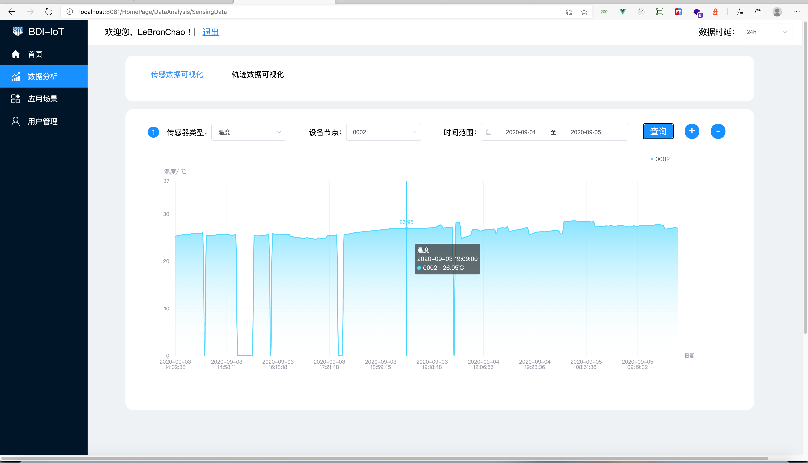

 

- 传感数据可视化页面的功能是数据查询。

用户通过以下操作可查询出对应传感器类型、对应设备、以及对应时间范围的传感数据。

1. 首先通过选择器选择查找数据的传感器类型

2. 通过选择器选择对应设备，标识为设备ID。

3. 通过日期选择器选择需要查询的时间范围。

4. 点击查询按钮。

 

- 同时可通过加号添加多个传感设备，形成对比图效果。
- 多个设备时需为同一传感类型、同一时间范围。

 

- 查询数据后显示的是对应传感器类型、对应设备、以及对应时间范围的传感数据的折线图。

- 横坐标为具体时间 时间格式为  年-月-日 时:分:秒

- 鼠标放置到对应坐标点悬浮窗显示具体日期和传感数据 时间格式为：年-月-日 时:分:秒

 

 

## 5.2轨迹数据可视化

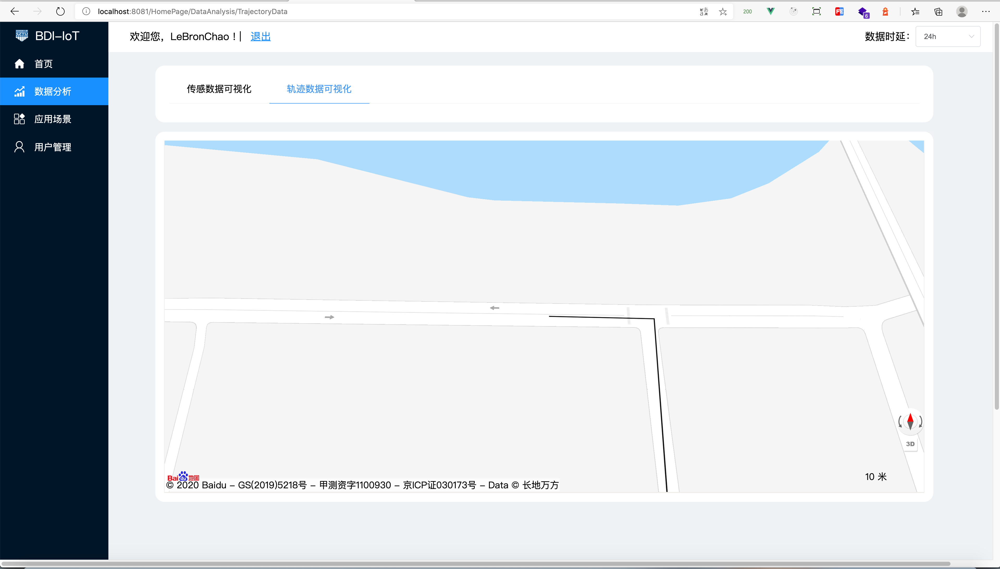

 

- 轨迹数据可视化页面为轨迹动画，动画轨迹为GPS传感器上传的连续GPS位置数据绘制成的轨迹

 

 

# 6.应用场景

## 6.1校园安全

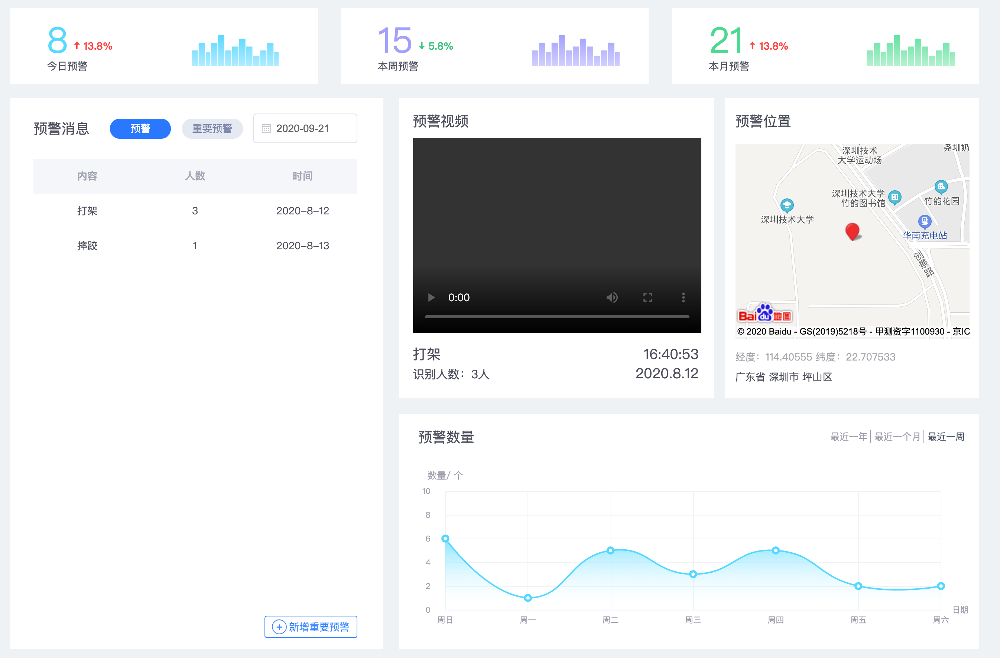

 

### 6.1.1顶部

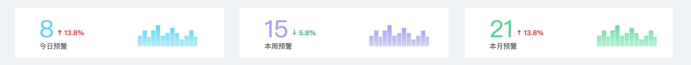

- 顶部显示的是今日、本周、本月的预警次数，以及相对昨日、上周、上月的上升或下降的百分比。

 

### 6.1.2预警列表

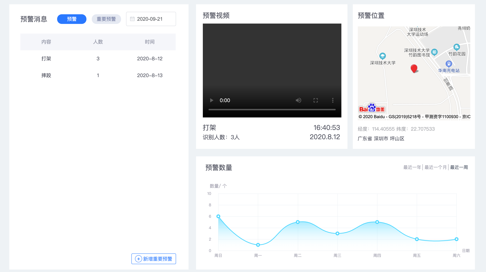

 

- 左边的预警消息默认显示的是当日预警列表，用户可使用日期选择器选择需查询的日期，显示出对应预警列表。
- 预警列表显示了预警类型、人数和时间，点击列表中的预警，右边的预警视频和预警位置可以显示出对应的视频片段和预警所在位置。
- 点击新增重要预警按钮

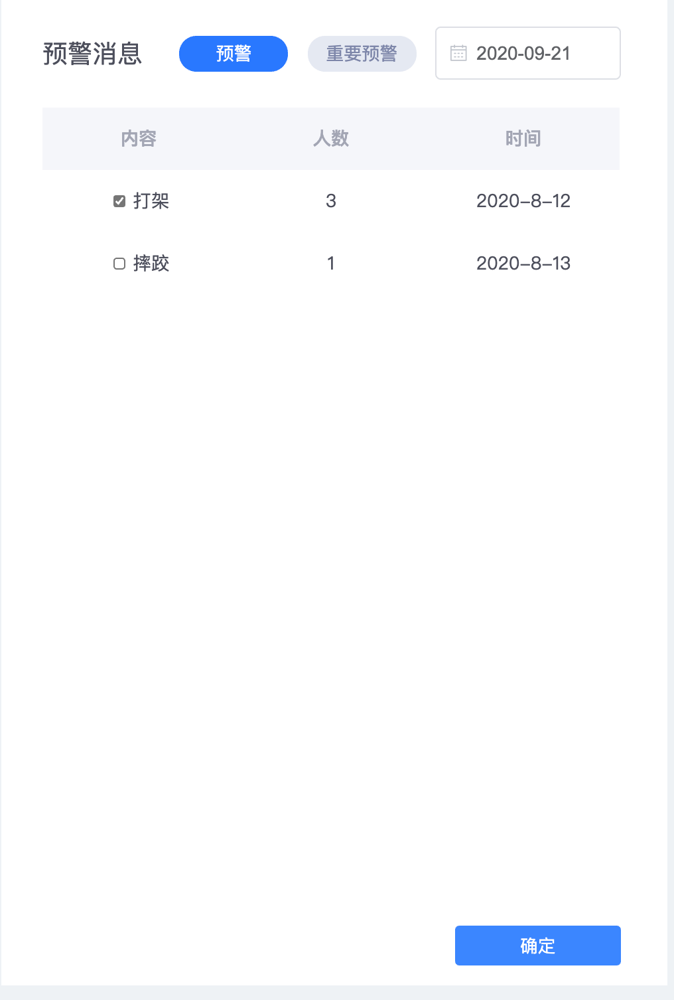

- 即可勾选需加入重要预警列表的预警，并点击“确认”按钮提交。

 

### 6.1.3重要预警列表

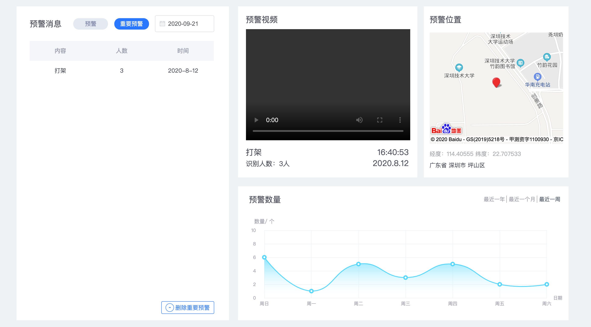

 

- 左边的预警消息显示的是重要预警预警列表，预警列表显示了预警类型、人数和时间，点击列表中的预警，右边的预警视频和预警位置可以显示出对应的视频片段和预警所在位置。
- 点击“删除重要预警”按钮

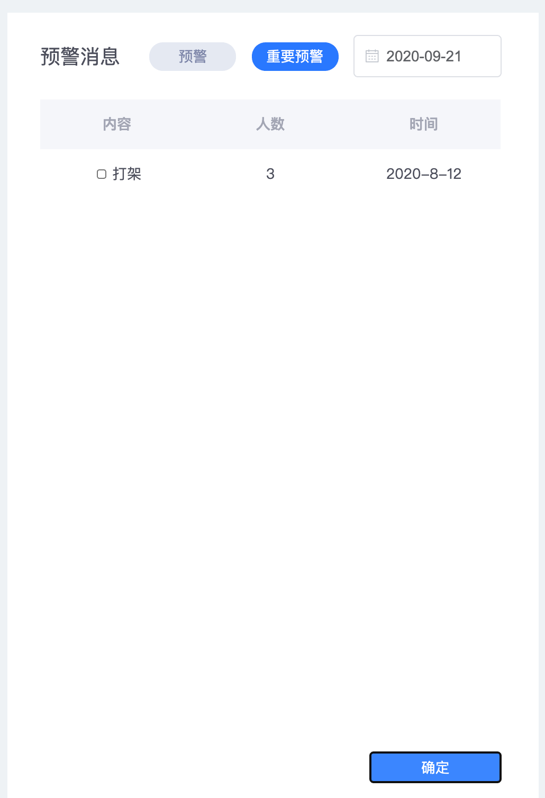

- 即可勾选需删除的重要预警，并点击“确认”按钮提交。

 

### 6.1.4预警视频

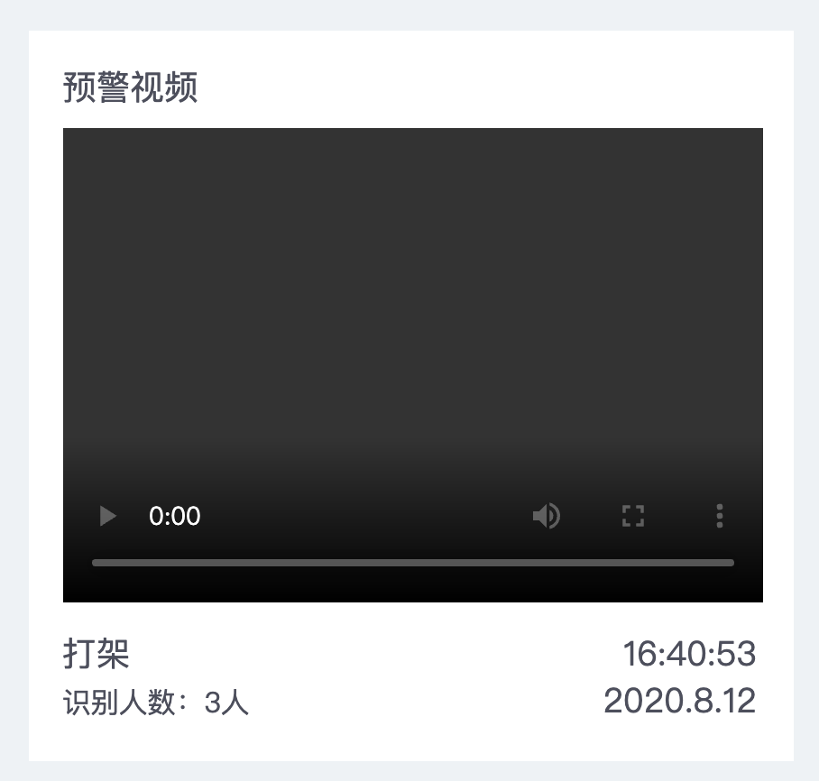

- 用户在预警列表或重要预警列表选择预警后，预警视频模块除显示视频片段外，还会显示预警类型、人数和具体时间。

 

### 6.1.5预警位置

- 用户在预警列表或重要预警列表选择预警后，预警位置模块显示预警在地图上的位置，显示经纬度和地址。

 

### 6.1.6预警数量

- 预警数量模块默认显示最近一周预警数量折线图，用户可点击“最近一个月”、“最近一年”等选项，显示对应时间范围的预警数量趋势折线图。

 

 

# 7.用户管理

## 7.1管理员用户管理

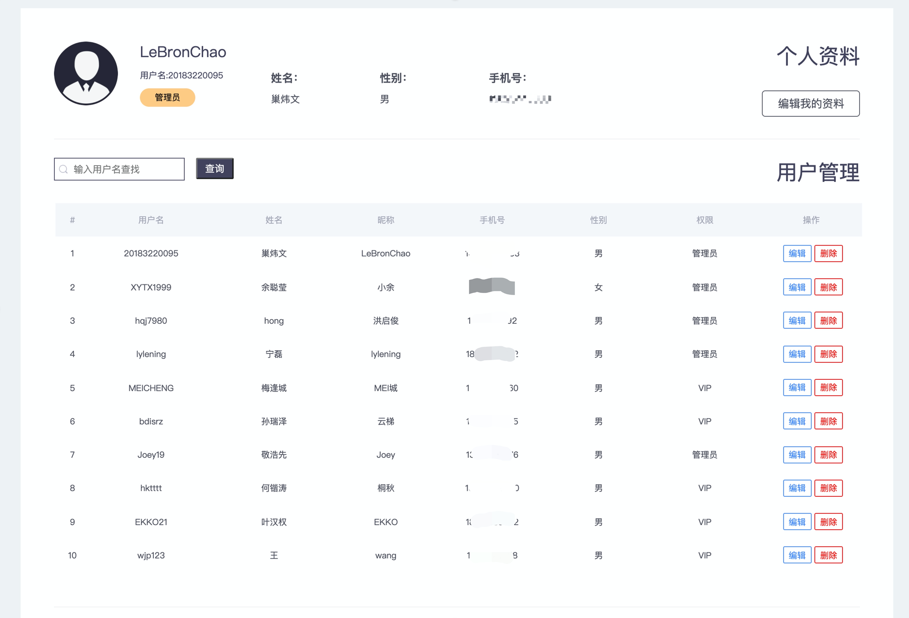

### 7.1.1显示及编辑个人用户信息

- 顶部模块显示的是个人信息，包括昵称、用户名、用户权限登记、姓名、性别、手机号等。
- 点击“编辑我的资料”后即可编辑、修改个人信息

 

- 编辑完成后，可点击“提交”按钮完成修改或点击“取消”按钮取消修改。

### 7.1.2用户管理

1.信息编辑

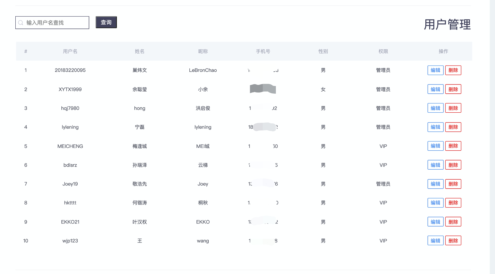

- 管理员点击对应用户的“编辑”按钮，可对该用户的信息进行编辑，包括用户名、姓名、昵称、手机号、性别、权限等。

- 点击“提交”按钮即可完成修改，点击“取消”按钮可取消修改。

 

2.用户删除

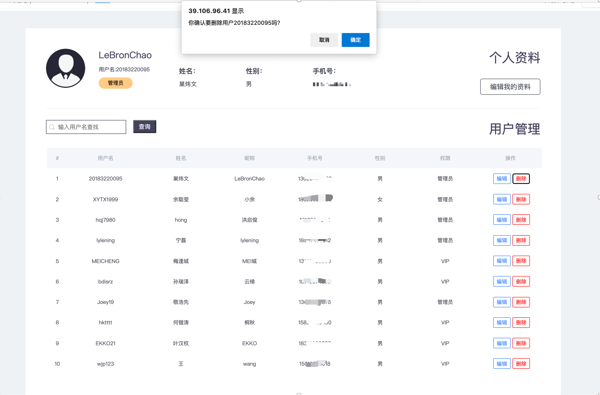

- 点击对应用户的“删除”按钮，弹出提示框，你确认要删除20183220095（对应用户用户名）吗？ 点击“确定”，即可成功删除用户。点击“取消”，取消删除用户操作。

 

 

3.用户查找

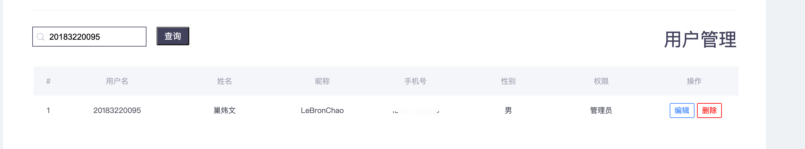

- 用户过多难以在列表中查找时，可通过查询模块查找。首先在输入框中输入需查找用户的用户名，点击“查询”，列表中即可显示目标用户。接下来可进行上述一系列用户管理操作。

 

### 7.1.3管理员密码管理

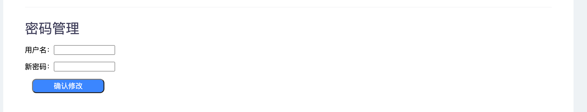

- 管理员在对应输入框内输入需更改“登陆密码”的“用户名”和“新密码”，点击确认修改，即可修改成功。

 

 

## 7.2普通用户用户管理

### 7.2.1显示及编辑个人用户信息

- 顶部模块显示的是个人信息，包括昵称、用户名、用户权限登记、姓名、性别、手机号等。

- 点击“编辑我的资料”后即可编辑、修改个人信息

 

- 编辑完成后，可点击“提交”按钮完成修改或点击“取消”按钮取消修改。

 

### 7.2.2密码管理

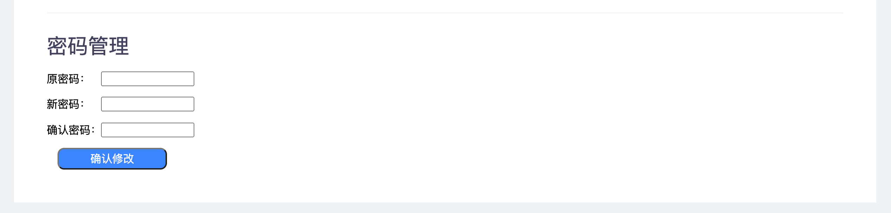

- 在对应输入框内输入本账户的“原密码”，“新密码”和“确认密码”，输入项皆合法，点击确认修改，即可修改成功。

 

- 原密码：本账户的登陆密码

- 新密码：修改后的密码，6-18位，由字母、数字或下划线组成。

- 确认密码：与新密码完全一致。

 

 

# 8.用户登出

- 在任意页面，点击顶部的“退出”按钮，即可退出账户，跳转至登录页面。

 